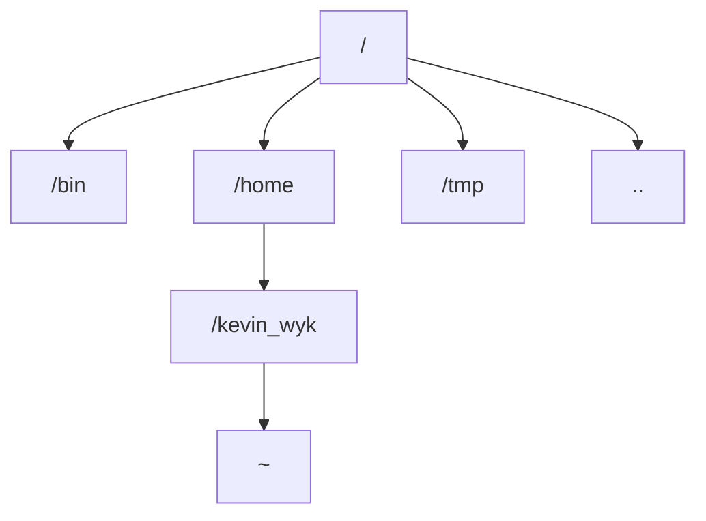

### Introduction

- This chapter aimed to get familiar with the basic operation of the Linux commands. The version used as the terminal is **Ubuntu**.

### Important Command

#### Change Directory

- Basic command: ``cd pathname`` 
  - It's used to enter the directory in current directory.
  - It seems to be equivalent to ``cd ./pathname``
- Special characters
  - Root directory: ``/``
  - Home directory: ``~``
  - Current directory: ``.``
  - Parent directory: ``..``

#### Directory Tree

