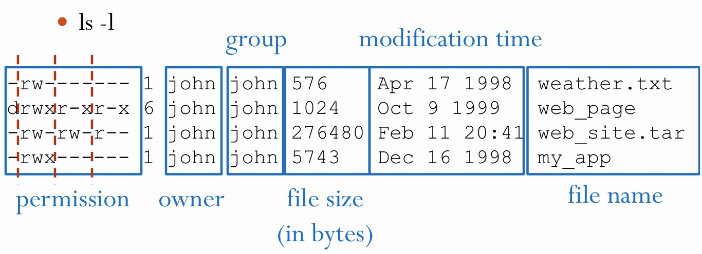
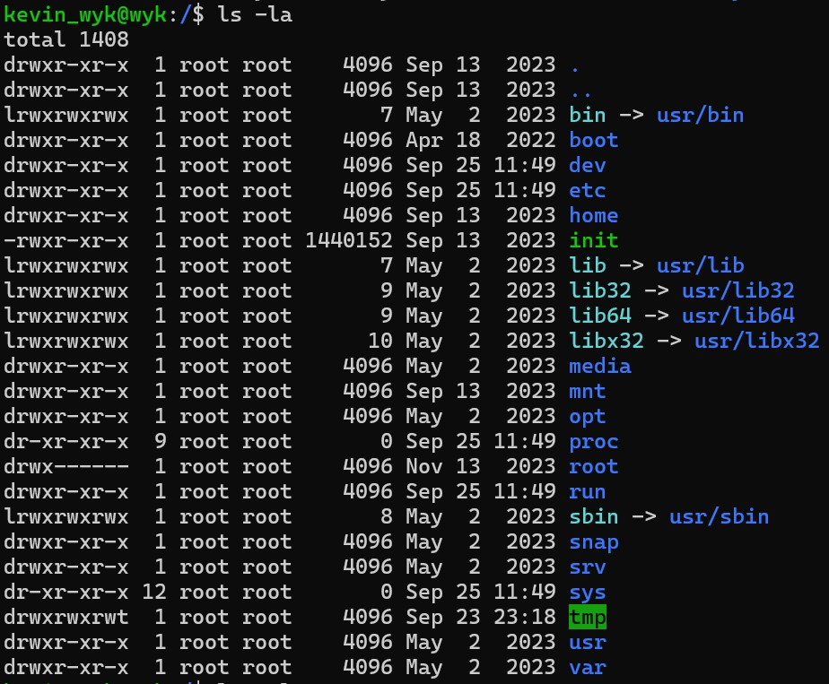

## Introduction

- This chapter aimed to get familiar with the basic operation of the Linux commands. The version used as the terminal is **Ubuntu**.

## Important Command

### Change Directory

- **Basic command**: ``cd pathname`` 
  - It's used to enter the directory in current directory.
  - It seems to be equivalent to ``cd ./pathname``
- Special characters
  - Root directory: ``/``
  - Home directory: ``~`` or empty
  - Current directory: ``.``
  - Parent directory: ``..``

### Directory Tree

### List Contents of a Directory

- **Basic Command**: ``ls [directory]``
  - ``ls`` lists current directory 
  -  ``ls directory`` lists the situation of ``./directory/``
- Further Command:
  - ``ls -a [directory]`` : List all files including the hidden. e.g. ``.bash_history``
  - ``ls -l [directory]`` : List detailed information of files.
  - ``ls -l -a``, ``ls -la``,``ls -al`` are equivalent.
  
#### Detailed information

**Explanation**

- `total *` : It indicates the total size of the files.

- ``.`` symbolizes current directory
-  ``..`` symbolizes parent directory.

-  First character: `-` regular file, `d` directory, `l` shortcut.
-  Next three: read, write, execution permission of the ownner
-  Next three: read, write, execution permission of the group
-  Final three: read, write, execution permission of everyone else

### Create/Delete Directories/Files

- `mkdir dir` : Create directories
- `rmdir dir` : Delete directories
- `touch files` : Create empty files
- `rm files`: Delete files
- `rm -r dir` Delete dir along with its contents.

### Copy Files/Directories

- **Basic command**: `cp source destination`
  - **Notice** : the operation of `cp` is overlapping.

- `cp file1 file2`: copy the content of file1 into file2.
  - If file2 exists, the content of file2 will be substitute by file1.
  - If file2 does not exists, file2 will be the copy of file1.
  
- `cp file1 dir` : copy file into a directory.
  - If file1 exists, overlapping will work.
  - If dir does not exists, `dir` will be recognized as files.
  - - `cp file1 file2 dir`
    - `cp file* dir`
- `cp -r dir1 dir2` :
  - `-r` means recursive.
  - If dir2 does not exist, copy dir1 as dir2.
  -  If dir2 exists, copy dir1 **inside** dir2, which means dir2 include a directory named dir1.
-  `*`: a wildcard which can represent any character string (even an empty string)
-  
