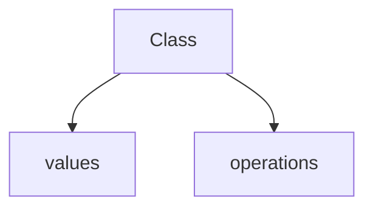

## Introduction

13. Abstract Data Type

14. Subtypes; Inheritance; Virtual Functions

15. Interfaces; Invariants

### Role of the Type

1. The set of values.
2. The set of operation.

#### Struct Type

- Every detail of the type is known.
- This is sometimes called the concrete implementation.

### Abstract Data Types

- Provide an Abstract description of values and operations.
- leaving out details.
  - Information hiding
  - Enscasulation (封装)
- Only operations defined for that type could access the representation

**"class" provide ADT mechanism"**



### Classes - More details 

- pubilc: visible for all.
  private: only visible for the class.

 **Note**:  
 You can actually define the functions within the class definition (define in `.h`).
 But this "exposes" information, which is best left hidden! (write in `.cpp`)

 ```cpp
int anInt::get_value() {
  return v;
}
 ```

Use the pointer of class as reference arguemnt

 ```cpp
 void add_one(anInt *ip) {
 ip->set_value(ip->get_value() + 1);
 }
 ```

 ### How to construct ADT

- chosse representation
  - Decide concrete data elements.
  - provide implementation of each method.

### Initialization

```cpp 

IntSet(); // EFFECTS: creates an empty IntSet

IntSet::IntSet(): numElts(0) {} // Recommended

IntSet::IntSet() { numElts = 0;} // Not Recommended
```

### Const 

```cpp
 int size() const;
```

-  ``this`` is a pointer to the current instance on which the function is invoked.
-  ``const`` keyword modifies the implicit ``this`` pointer: ``this``
 is now a pointer to a const instance, which can avoid **accidentally  modifying**.

**Note:**
- If a const member function calls other member functions, they must be const too!

### Subtypes

- `S <: T` : S is a subtype of T or T is a supertype of S.
-  Subtypes are different from the notion of "type-convertible"
  -  If you use a subtype where a supertype is expected, it is not converted to the supertype.

#### Create a subtype

- Add some new method.
- Strengthen the postcondition of one or more operations.
- Weaken the precondition of one or more operations.

### Inheritance Mechanism

**public/protected inheritance:**

```cpp
class bar : public foo {...};
```

**private inheritance**

```cpp
class bar : private foo {...};
```


| Access Level   | Accessible in Class | Accessible in Subclass | Accessible Outside |
|----------------|--------------------|------------------------|--------------------|
| **private**    | ✅                 | ❌                     | ❌                 |
| **protected**  | ✅                 | ✅                     | ❌                 |
| **public**     | ✅                 | ✅                     | ✅                 |


#### Virtual Functions


```cpp
 class IntSet {
 ...
 public:
 ...
 virtual void insert(int v);
 ...
 };

 void IntSet::insert(int v) { // OK
 }

 class PosIntSet: public IntSet {
 ...
 public:
 void insert(int v); // OK
 ...
 };

```


### Interfaces

#### Abstract base class

It provides an "interface-only" definition.

-  Declare each method as a virtual function
-  "Assign" a zero to each of these virtual functions.
  
```cpp
class IntSet {
 public:
 virtual void insert(int v) = 0;
 virtual void remove(int v) = 0;
 virtual bool query(int v) = 0;
 virtual int size() = 0;
 };
```

- These functions are called pure virtual functions and are declared not to exist.
  -  A class with one or more Pure Virtual Functions is an abstract class.
  -  We **cannot create any instances** of an abstract class, because there are no implementation. 
  -  We can **define references and pointers** to an abstract class,
- Think about them as a set of function pointers, all of which point to NULL.

#### Interfaces and Implementation 


| Category   | File Name | 
|----------------|--------------------|
| **Interface**    | *.h                 | 
| **Implementation**  | *.cpp                 | 


**Note:** We can not directly create a object of the derived class, because acutaully the definition of the class is invisible to users.

#### How to create

1. Use a access function to return a pointer.

```cpp
 IntSet *getIntSet();
 // EFFECTS: returns a pointer
```

2. Define static instance if single object is needed.


### Invariants

It seems to be some requirements of the data member.

- Writing “checker” functions.


```cpp
 bool repOK();
 // EFFECTS: returns true if the
 //          rep. invariants hold

assert(repOK());

```