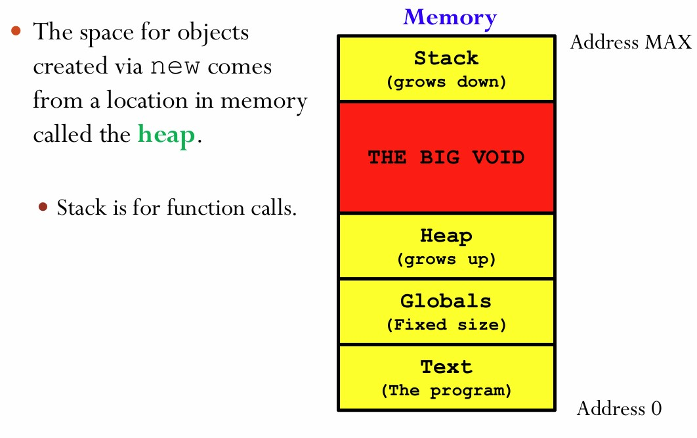
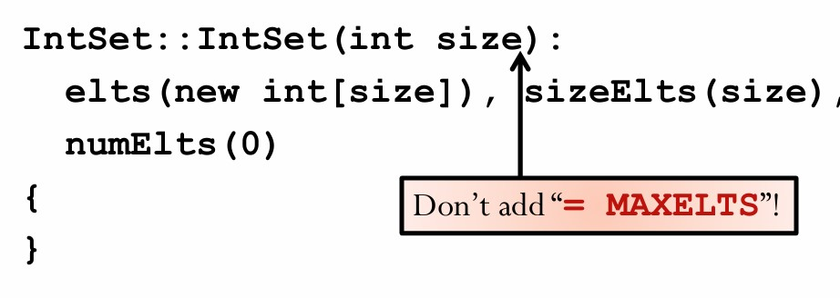

## Introduction

16. Dynamic Memory Allocation; Overloading, Default Arguments; Destructor

17. Dynamic Resizing

### Memory


| Category   | Mechanism | 
|----------------|--------------------|
| **Global Variables**    | defined anywhere outside of a function definition  / space is reserved at compile time.              | 
| **Local Variables**  | defined within a block    / space is reserved at compile time.             | 
| **dynamic**  |  not need to know how big it is / no need to know how long it lives.             | 


-  ``new`` : Reserve space for an object of some type, initialize the object, and return a pointer to it.
-  ``delete`` :  Given a pointer to an object created by new, destroy the object and release the space previously occupied by 
that object.

**Remark:** We cannot delete an object not created by new.

### Memory Leak

```cpp
int *p1 = new int(1);
int *p2 = new int(2);
p1 = p2;
```

The dynamic memory of p1 leaks.

- ` valgrind--leak-check=full ./program <args>`: check whether memory leak exists.

#### Heap:



### Dynamic Arrays

We can create dynamically sizes unknown to the compiler initially.

```cpp
int *ia = new int[5];
delete[] ia;

class IntSet {
    int *elts;    // pointer to dynamic array
    int sizeElts; // capacity of array
    int numElts;  // current occupancy
    public:
    ...
}

IntSet::IntSet() {
    // Allocate the "default-size" array
    elts = new int[MAXELTS];
    sizeElts = MAXELTS;
    numElts = 0;
}

IntSet::IntSet(): elts(new int[MAXELTS]),sizeElts(MAXELTS), numElts(0){} 
//initialization syntax

```

###  Overloaded Constructor and Default Argument

```cpp
 class IntSet {
 int *elts;    // pointer to dynamic array
 int sizeElts; // capacity of array
 int numElts;  // current occupancy
 public:
 IntSet();   // default constructor
 // EFFECTS: create a MAXELTS capacity set
 IntSet(int size); // constructor with
 // explicit capacity
 // REQUIRES: size > 0
 // EFFECTS: create a size capacity set
 };
```

#### Functions Overloading

- Two different functions with exactly the same name, but different argument count and/or argument types.
```cpp
int average(int a, int b);
double average(double a, double b);
int average(int a, int b, int c);
```

#### Default Argument

```cpp
int add(int a, int b, int c = 1);
// The default value of c is 1.

add(1, 2) // a = 1, b = 2, c = 1 (default value)
add(1, 2, 3) // a = 1, b = 2, c = 3

int add(int a, int b = 0, int c = 1) // OK
int add(in a, int b = 1, int c) // Error
```

Default arguemnt could only appear in the declare part.



### Destructor

- The constructor ensures that the object is a legal instance of its  class and the destructor's job is to destroy the object.

```cpp
 class IntSet {
 int *elts;    // pointer to dynamic array
 int sizeElts; // capacity of array
 int numElts;  // current occupancy
 public:
 IntSet(int size = MAXELTS);
 // EFFECTS: create a set with size capacity; 
//          capacity is MAXELTS by default.
 ~IntSet(); // Destroy this IntSet
 ...
 };
```
When you call `delete`, you call `destructor`.

### Deep Copy

#### Dangles

Because x will automatically destroy when the function complete. s will lose track.

```cpp
void foo(IntSet x) {
 // do something
 }
 void main() {
 IntSet s;
 s.insert(5);
 foo(s);
 s.query(5);
 }
```

- When a class contains pointers to dynamic elements, copying it is tricky.
- If we just copy the "members of the class", we get a **shallow copy**.
- Usually, we want a full copy of everything. This is called a **deep copy**.


- The C++ class mechanism provides two very closely related mechanisms that copy class objects:
  - **Copy constructor** and **assignment operator**.
  
#### Copy constructor

```cpp
 class IntSet {
 int *elts;    
// array of elements
 int numElts;  // number of elements in array
 int sizeElts; // capacity of array
 void copyFrom(const IntSet &is);
 // MODIFIES: this
 // EFFECTS:  copies is’ contents to this
 public:
 IntSet(int size=MAXELTS); // client optionally
 // names size
 IntSet(const IntSet &is); // copy constructor
 ...
 };

void IntSet::copyFrom(const IntSet &is) {
  if (is.sizeElts != sizeElts) { // Resize array
  delete[] elts;
  sizeElts = is.sizeElts;
  elts = new int[sizeElts];
}
 // Copy array
for (int i = 0; i < is.sizeElts; i++) { 
    elts[i] = is.elts[i];
}
// Establish numElts invariant
numElts = is.numElts; 
}

```

-  `copyFrom` is a method and it must maintain the representational invariants. Here's what it must do:
    -  It has to assume that the source and destination sets might have different sizes.  If so, it will have to resize the array appropriately, by destroying and reallocating it.
    -   Copy the source array to the destination array.
    -    Copy sizeElts and numElts.


### Assignment Operators

`compound expression`: x = y = z;

Assignment operators binds right-to-left.

#### Overload

```cpp
 class IntSet {
 // data elements
 ...
 public:
 // Constructors
 ...
 IntSet &operator= (const IntSet &is);
 ...
 }

 void IntSet::copyFrom(const IntSet &is) {
 if (is.sizeElts != sizeElts) { // Resize array
 delete[] elts;
 sizeElts = is.sizeElts;
 elts = new int[sizeElts];
 }
 // Copy array
 for (int i = 0; i < is.sizeElts; i++) { 
    elts[i] = is.elts[i];
 }
 // Establish numElts invariant
 numElts = is.numElts; 
}

IntSet &IntSet::operator= (const IntSet &is) {
  if(this != &is)
  copyFrom(is);
  return *this;
}
```

### Dynamic Resizing

```cpp
void grow() {
  int *tmp = new int[sizeElts * 2];
  for (int i = 0; i < numElts; i++) {
    tmp[i] = elts[i];
  }
  delete [] elts;
  elts = tmp;
  sizeElts *= 2;
}
```