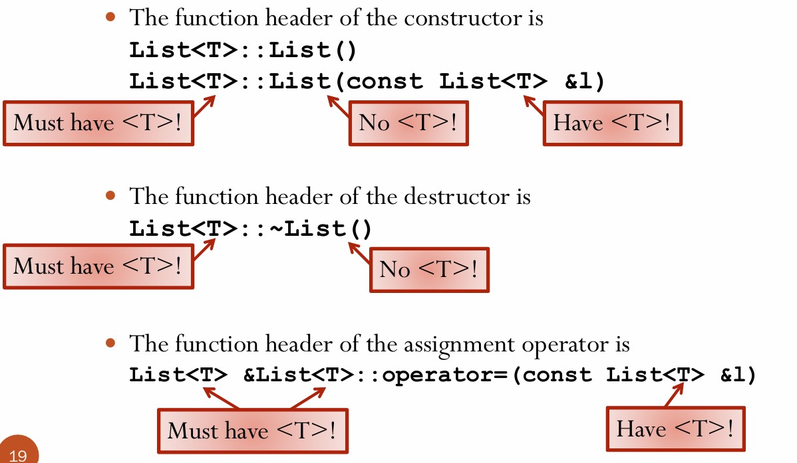

### Introduction

20. Template; Container

21. Operator Overloading

### Containers

- Their purpose in life is to `contain` other objects, and they generally have no intrinsic meaning on their own.

-  Reusing code for different types is called **polymorphism** or **polymorphic code**.
  
-  We can use a C++ mechanism called "templates" to write the container code only once.

```cpp
template <class T>
class List {
public:
 // methods
 // constructors/destructor
  private:
  struct node {
    node *next;
    T v;
  };
...
};

 template <class T>
 class List {
 ...
 };
 template <class T>
 void List<T>::insert(T v) {
 ...
 }

// Create a static list of integers
 List<int> li;
 // Create a dynamic list of integers
 List<int> *lip = new List<int>;
 // Create a dynamic list of doubles.
 List<double> *ldp = new List<double>;

```

**Remark:**
- We should put your class member function definition also in the `.h` file, following class definition. So, there is no `.cpp` for member functions



### Container of Pointers

We use pointer to deliver a **big thing**.

1. `Existence Rule`: An object must be dynamically allocated before a pointer to it is inserted.
2. `Ownership Rule`: Once a pointer to an object is inserted, that object becomes the property of the container. It can only be modified through the methods of the container.
3. `Conservation Rule`: When a pointer is removed from a container, either the pointer must be inserted into some container, or its referent must be deleted after using.

#### Two such methods that could destroy a container

- The destructor:  Destroys an existing instance.

- The assignment operator:  Destroys an existing instance before copying the contents of another instance.


### Polymorphic Container

```cpp
 class Object {
    public:
    virtual ~Object() { }
 };

struct node {
    node   *next;
    Object *value;
 };

class List {
    ...
    public:
    void insert(Object *o);
    Object *remove();
    ...
}; 


//legal
BigThing *bp = new BigThing;
l.insert(bp);

Object *op;
BigThing *bp;
op = l.remove();
bp = dynamic_cast<BigThing *>(op);
```

Avoid shallow copy:

```cpp
class Object {
  public:
  virtual Object *clone() = 0;
  // EFFECT: copy this, return a pointer to it
  virtual ~Object() { }
};

class BigThing : public Object {
 ... 
public:
  Object *clone();
  ...
  BigThing(const BigThing &b);    
}

Object *BigThing::clone() {
  BigThing *bp = new BigThing(*this);
  return bp;  // Legal due to substitution
  // rule
}

```

### Operator Overloading

**Overloaded operators** are functions with special names: the keyword operator followed by the symbol (e.g., +,-, etc.) of the operator being redefined.

```cpp
 A operator+(const A &l, const A &r);
 // returns l “+” r
 A A::operator+(const A &r);
 // returns *this “+” r
```

Overload `operator+=` for a class of complex number.

```cpp
 class Complex {
 // OVERVIEW: a complex number class
 double real;
 double imag;
 public:
 Complex(double r=0, double i=0); // Constructor
 Complex &operator += (const Complex &o);
 // MODIFIES: this
 // EFFECTS: adds this complex number with the
 // complex number o and return a reference
 // to the current object.
 };

 Complex &Complex::operator += (const Complex &o){
 real += o.real;
 imag += o.imag;
 return *this;
 }
```

##### Advantage of `&`

- Support chaining.
- Avoid copy object.

#### Friend

```cpp
class foo {
  friend void baz();
  int f;
};
void baz() { ... }

//The function baz has access to f, which would  otherwise be private to class foo.

class foo {
    friend class bar;
    int f;
};
class bar {
 ...
};

//Then, objects of class bar can access private member f of foo

class Complex {
    // OVERVIEW: a complex number class
    double real;
    double imag;
    public:
    Complex(double r=0, double i=0);
    Complex &operator += (const Complex &o);
    friend Complex operator+(const Complex &o1, 
    const Complex &o2);
};
// Its implementation is the same as before

```

#### Overloading Operator []

```cpp
const int &IntSet::operator[](int i) const {
  if(i >= 0 && i < numElts) return elts[i];
  else throw -1;
}
// const version returning a const reference to int
// first const: reture a const value, can't change.
// second const: can't change the member data.

int &IntSet::operator[](int i) {
  if(i >= 0 && i < numElts) return elts[i];
  else throw -1;
}
// nonconst version returning a reference to int

```

#### Overloading Output Operator <<

**Remark**: operator<< must be a nonmember function!

- The ``operator<<`` should take an ``ostream&`` as its first parameter and a **const reference** to an object of the class type as its second.
-  `operator<<` can be chained together $\Rightarrow$  `operator<<` return a reference
  
```cpp
 ostream &operator<<(ostream &os, const IntSet &is){
 for(int i = 0; i < is.size(); i++)
 os << is[i] << " ";
 return os;
 }
```
-  The ``operator>>`` should take an istream& as its first 
parameter and a **nonconst reference** to a object of the class 
type as its second.