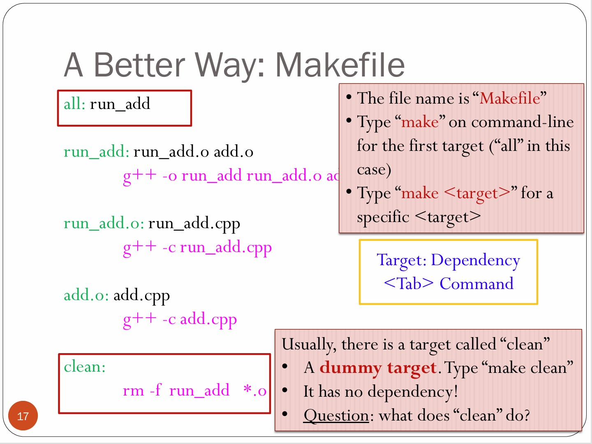
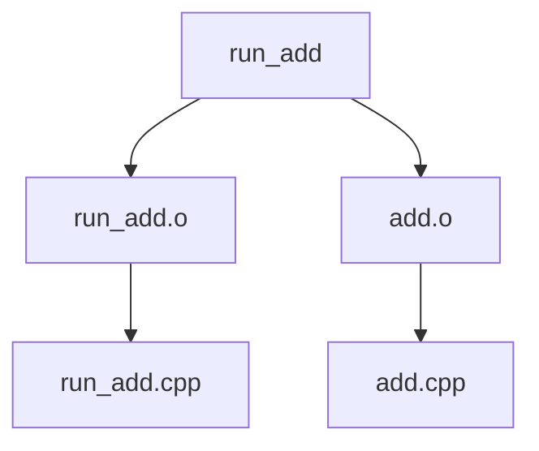

## Introduction

This chapter aims to understand the compilation process, how to compile a single source file and how to compile multiple source files

**Basic Working Mechanism of Computer**

Code -> Compile+linkers(Programs) -> Machine Code ->  CPU(computer)

## Developing a Program on Linux

- Writing the source code
- Compile the program
  - `g++ -o program source.cpp`
    - `-o` option tells what the name of the output file is.
  - `g++ -c source.cpp` + `g++ -o program source.o`
    - It is equivalent to the first choice
    - `-c` means compilation only.
    - `**.o` means unlinked object code.
- Run the program
  - `./program`
  
 **Diagram** : 
  
 **Useful options** : 
  - `-g` : Put debugging information in the executable file
  - `-Wall` : Turn on all warnings.
  
**E.g.**


### Problem of Multiple Definition

**Solution**: Header guard.

```cpp
//add.h
#ifndef ADD_H
#define ADD_H
int add(int a,int b)
#endif
```

### Another way to compile

```bash
g++ -Wall -o run_add run_add.cpp add.cpp
=
g++ -Wall -c run_add.cpp
g++ -Wall -c add.cpp
g++ -Wall -o run_add run_add.o add.object
```





#### [Useful Reference](https://zhuanlan.zhihu.com/p/618350718)